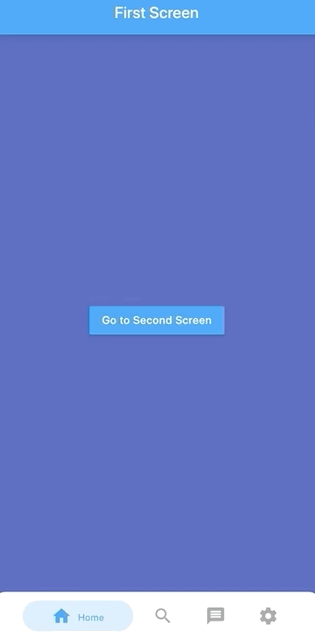
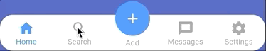
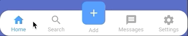
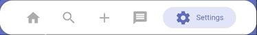
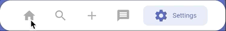
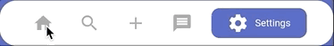
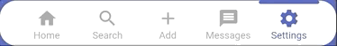
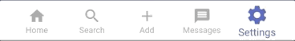
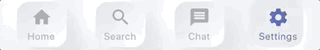
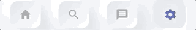

# Persistent Bottom Navigation Bar

[](https://pub.dev/packages/persistent_bottom_nav_bar)
[](https://github.com/BilalShahid13/PersistentBottomNavBar/blob/master/LICENSE)
[](https://github.com/BilalShahid13/PersistentBottomNavBar/stargazers)

A persistent/static bottom navigation bar for Flutter.

NOTE: Those migrating from **pre 2.0.0** version should check the latest Readme and instructions as there are many breaking changes introduced in the 2.0.0 update



## Styles

| Style15  | Style16 |
| ------------- | ------------- |
|   |   |

| Style1  | Style9 |
| ------------- | ------------- |
|   |   |

| Style7  | Style10 |
| ------------- | ------------- |
|   |   |

| Style12  | Style13 |
| ------------- | ------------- |
|   |   |

| Style3 | Style6 |
| ------------- | ------------- |
|   |   |

| Neumorphic  | Neumorphic without subtitle |
| ------------- | ------------- |
|   |   |

### Note: These do not include all style variations

## Features

- Highly customizable `persistent` bottom navigation bar.
- Ability to push new screens with or without bottom navigation bar.
- 20 styles for the bottom navigation bar.
- Includes functions for pushing screen with or without the bottom navigation bar i.e. pushNewScreen() and pushNewScreenWithRouteSettings().
- Based on flutter's Cupertino(iOS) bottom navigation bar.
- Can be `translucent` for a particular tab.
- Custom styling for the navigation bar. Click [here](#custom-navigation-bar-styling) for more information.
- Handles hardware/software Android back button.

## Getting Started

In your flutter project add the dependency:

```yaml
dependencies:
  persistent_bottom_nav_bar: any
```

Import the package:

```dart
import 'package:persistent_bottom_nav_bar/persistent-tab-view.dart';
```

Persistent bottom navigation bar uses `PersistentTabController` as its controller. Here is how to declare it:

```dart
PersistentTabController _controller;

_controller = PersistentTabController(initialIndex: 0);

```

The main widget then to be declared is `PersistentTabView`. NOTE: This widget includes SCAFFOLD (based on `CupertinoTabScaffold`), so no need to declare it. Following is an example for demonstration purposes:

```dart

class MyApp extends StatelessWidget {
  const MyApp({Key key}) : super(key: key);

  @override
  Widget build(BuildContext context) {
    return PersistentTabView(
        context,
        controller: _controller,
        screens: _buildScreens(),
        items: _navBarsItems(),
        confineInSafeArea: true,
        backgroundColor: Colors.white, // Default is Colors.white.
        handleAndroidBackButtonPress: true, // Default is true.
        resizeToAvoidBottomInset: true, // This needs to be true if you want to move up the screen when keyboard appears. Default is true.
        stateManagement: true, // Default is true.
        hideNavigationBarWhenKeyboardShows: true, // Recommended to set 'resizeToAvoidBottomInset' as true while using this argument. Default is true.
        decoration: NavBarDecoration(
          borderRadius: BorderRadius.circular(10.0),
          colorBehindNavBar: Colors.white,
        ),
        popAllScreensOnTapOfSelectedTab: true,
        popActionScreens: PopActionScreensType.all,
        itemAnimationProperties: ItemAnimationProperties( // Navigation Bar's items animation properties.
          duration: Duration(milliseconds: 200),
          curve: Curves.ease,
        ),
        screenTransitionAnimation: ScreenTransitionAnimation( // Screen transition animation on change of selected tab.
          animateTabTransition: true,
          curve: Curves.ease,
          duration: Duration(milliseconds: 200),
        ),
        navBarStyle: NavBarStyle.style1, // Choose the nav bar style with this property.
    );
  }
}

```

```dart

    List<Widget> _buildScreens() {
        return [
          MainScreen(),
          SettingsScreen()
        ];
    }

```

```dart

    List<PersistentBottomNavBarItem> _navBarsItems() {
        return [
            PersistentBottomNavBarItem(
                icon: Icon(CupertinoIcons.home),
                title: ("Home"),
                activeColor: CupertinoColors.activeBlue,
                inactiveColor: CupertinoColors.systemGrey,
            ),
            PersistentBottomNavBarItem(
                icon: Icon(CupertinoIcons.settings),
                title: ("Settings"),
                activeColor: CupertinoColors.activeBlue,
                inactiveColor: CupertinoColors.systemGrey,
            ),
        ];
    }

```

## Navigator Functions

To push a new screen, use the following functions to control the `visibility` of bottom navigation bar on a particular screen. You can use your own logic to implement `platform-specific` behavior. One of the solutions could be to use the property `withNavBar` and toggle it according to the Platform.

In `platform-specific` behavior, while pushing a new screen, on `Android` it will push the screen WITHOUT the bottom navigation bar but on `iOS` it will persist the bottom navigation bar. This is the default behavior specified by each platform.

```dart

    pushNewScreen(
        context,
        screen: MainScreen(),
        withNavBar: true, // OPTIONAL VALUE. True by default.
        pageTransitionAnimation: PageTransitionAnimation.cupertino,
    );

```

```dart

    pushNewScreenWithRouteSettings(
        context,
        settings: RouteSettings(name: MainScreen.routeName),
        screen: MainScreen(),
        withNavBar: true,
        pageTransitionAnimation: PageTransitionAnimation.cupertino,
    );

```

If you are pushing a new `modal` screen, use the following function:

```dart

    pushDynamicScreen(
        context,
        screen: HomeModalScreen(),
        withNavBar: true,
    );

```

### Some Useful Tips

- Pop to any screen in the navigation graph for a given tab:

    ```dart
        Navigator.of(context).popUntil((route) {
            return route.settings.name == "ScreenToPopBackTo";
        });
    ```

- Pop back to first screen in the navigation graph for a given tab:

    ```dart
        Navigator.of(context).popUntil(ModalRoute.withName("/"));
    ```

    ```dart
        Navigator.of(context).pushAndRemoveUntil(
          CupertinoPageRoute(
            builder: (BuildContext context) {
              return FirstScreen();
            },
          ),
          (_) => false,
        );
    ```

- To push bottom sheet on top of the Navigation Bar, use showModalBottomScreen and set it's property `useRootNavigator` to true. See example project for an illustration.

## Floating Action Buttons & App Bars
### Floating Action Buttons
You can configure a floating action button that will sit above the navigation bar on the side of the screen by using `persistentFloatingActionButton`. This will stay floating when animating between screens, and replaces the now removed ~`floatingActionButton`~ property. Pass in a widget to this property (usually a `FloatingActionButton`), and it'll work out of the box.

If you need a particular FAB on one screen, wrap that screen's widget in another `Scaffold` and use the `floatingActionButton` property there. You'll need to add some bottom padding (wrap the `FloatingActionButton` in `Padding`) to move it out of the way of the `persistentFloatingActionButton` if one has been specified; you can use `66` logical pixels if using the default bar height.

One advanced setup would be to have the FAB expanded on the first screen, and standard size on all the others. This can be done using the code below:
```dart
FloatingActionButton.extended(
  onPressed: () {},
  isExtended: pageController.index == 0,
  label: AnimatedSwitcher(
    duration: Duration(milliseconds: 300),
    transitionBuilder: (Widget child, Animation<double> animation) =>
      FadeTransition(
        opacity: animation,
        child: SizeTransition(
          child: child,
          sizeFactor: animation,
          axis: Axis.horizontal,
        ),
      ),
    child: pageController.index != 0
      ? Icon(Icons.ac_unit)
      : Row(
        children: [
          Padding(
            padding: const EdgeInsets.only(right: 6.0),
            child: Icon(Icons.ac_unit)
          ),
          Text('AC UNIT')
        ],
     ),
  ),
),
```
### App Bar
You can configure an app bar that will strech at the top of the screen using `persistentAppBar`. This will stay floating when animating between screens. Pass in a `PrefferedSizeWidget` widget to this property (usually an `AppBar`), and it'll work out of the box.

If you need a particular app bar on one screen, wrap that screen's widget in another `Scaffold` and use the `appBar` property there. Because the `persistentAppBar` takes up space if it has been setup, any app bar in each screen will automatically position itself below the `persistentAppBar`.

## Custom Navigation Bar Styling

If you want to have your own style for the navigation bar, follow these steps:

1. Declare your custom widget. Please keep in mind that you will have to handle the function `onSelectedItem` and the integer `selectedIndex` yourself to maintain full functionality. Also please note that you can define your own model for the navigation bar item instead of the provided `PersistentBottomNavBarItem`. See this example below for better understanding:

    ```dart

        class CustomNavBarWidget extends StatelessWidget {
            final int selectedIndex;
            final List<PersistentBottomNavBarItem> items; // NOTE: You CAN declare your own model here instead of `PersistentBottomNavBarItem`.
            final ValueChanged<int> onItemSelected;

            CustomNavBarWidget(
                {Key key,
                this.selectedIndex,
                @required this.items,
                this.onItemSelected,});

            Widget _buildItem(
                PersistentBottomNavBarItem item, bool isSelected) {
                return Container(
                alignment: Alignment.center,
                height: 60.0,
                child: Column(
                    mainAxisAlignment: MainAxisAlignment.center,
                    crossAxisAlignment: CrossAxisAlignment.center,
                    mainAxisSize: MainAxisSize.min,
                    children: <Widget>[
                    Flexible(
                        child: IconTheme(
                        data: IconThemeData(
                            size: 26.0,
                            color: isSelected
                                ? (item.activeColorAlternate == null
                                    ? item.activeColor
                                    : item.activeColorAlternate)
                                : item.inactiveColor == null
                                    ? item.activeColor
                                    : item.inactiveColor),
                        child: item.icon,
                        ),
                    ),
                    Padding(
                        padding: const EdgeInsets.only(top: 5.0),
                        child: Material(
                        type: MaterialType.transparency,
                        child: FittedBox(
                            child: Text(
                            item.title,
                            style: TextStyle(
                                color: isSelected
                                    ? (item.activeColorAlternate == null
                                        ? item.activeColor
                                        : item.activeColorAlternate)
                                    : item.inactiveColor,
                                fontWeight: FontWeight.w400,
                                fontSize: 12.0),
                        )),
                        ),
                    )
                    ],
                ),
                );
            }

            @override
            Widget build(BuildContext context) {
                return Container(
                color: Colors.white,
                child: Container(
                    width: double.infinity,
                    height: 60.0,
                    child: Row(
                    mainAxisAlignment: MainAxisAlignment.spaceAround,
                    children: items.map((item) {
                        int index = items.indexOf(item);
                        return Flexible(
                        child: GestureDetector(
                            onTap: () {
                            this.onItemSelected(index);
                            },
                            child: _buildItem(
                                item, selectedIndex == index),
                        ),
                        );
                    }).toList(),
                    ),
                ),
                );
            }
        }

    ```

2. In the main `PersistentTabView` widget, set the `navBarStyle` property as `NavBarStyle.custom` and pass on the custom widget you just created in the `customWidget` property like this:

    ```dart

    class MyApp extends StatelessWidget {
        const MyApp({Key key}) : super(key: key);

        @override
        Widget build(BuildContext context) {
            return PersistentTabView.custom(
                context,
                controller: _controller,
                itemCount: items.length, // This is required in case of custom style! Pass the number of items for the nav bar.
                screens: _buildScreens(),
                confineInSafeArea: true,
                handleAndroidBackButtonPress: true,
                onItemSelected: (int) {
                    setState(() {}); // This is required to update the nav bar if Android back button is pressed
                },
                customWidget: CustomNavBarWidget( // Your custom widget goes here
                    items: _navBarsItems(),
                    selectedIndex: _controller.index,
                    onItemSelected: (index) {
                        setState(() {
                            _controller.index = index; // NOTE: THIS IS CRITICAL!! Don't miss it!
                        });
                    },
                ),
            );
        }
    }

    ```

    `NOTE: In the 'onSelected' function of the customWidget, don't forgot to change the index of the controller`

3. Done! As we can see, some of the other properties like `iconSize`, `items` are not required here so you can skip those properties. To control the **bottom padding** of the screen, use `bottomScreenPadding`. If you give too much `bottomScreenPadding` but less height in the custom widget or vice versa, layout issues might appear.

For better understanding, refer to the [example project](https://github.com/BilalShahid13/PersistentBottomNavBar/tree/master/example) in the official git repo.
