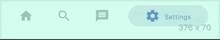
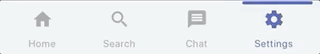
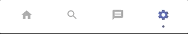
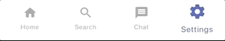
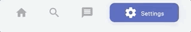
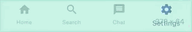

# persistent_bottom_nav_bar

A persistent bottom navigation bar for Flutter.


## Styles

`Neumorphic`


`Style1`



`Style3`



`Style5`



`Style6`



`Style7`



`Style8`



`Neumorphic without subtitle`


Note: These doesn't include all style variations.

## Features

- Highly customizable `persistent` bottom navigation bar.
- Ability to push new screens with or without bottom navigation bar.
- Includes platform specific behavior as an option (specify it in the two navigator functions).
- 12 styles for the bottom navigation bar (includes `BottomNavyBar` and `Neumorphic` style).
- Includes functions for pushing screen with or without the bottom navigation bar i.e. pushNewScreen() and pushNewScreenWithRouteSettings().
- Based on flutter's Cupertino(iOS) bottom navigation bar.
- Can be `translucent` for a particular tab.
- Custom styling for the navigation bar. See [here](#Custom Navigation Bar Styling)

## Getting Started

In your flutter project add the dependency:

```yaml
dependencies:
  persistent_bottom_nav_bar: any
```

Persistent bottom navigation bar uses `PersistentTabController` as its controller. Here is how to declare it:

```dart
PersistentTabController _controller;

_controller = PersistentTabController(initialIndex: 0);

```

The main widget then to be declared is `PersistenTabView`. NOTE: This widget includes SCAFFOLD (based on `CupertinoTabScaffold`), so no need to declare it. Following is an example for demonstration purposes:

```dart

class MyApp extends StatelessWidget {
  const MyApp({Key key}) : super(key: key);

  @override
  Widget build(BuildContext context) {
    return PersistentTabView(
      controller: _controller,
      items: _navBarsItems(),
      screens: _buildScreens(),
      showElevation: true,
      navBarCurve: NavBarCurve.upperCorners,
      iconSize: 26.0,
      navBarStyle: NavBarStyle.style1, // Choose the nav bar style with this property
      onItemSelected: (index) {
        print(index);
      },
    );
  }
}

```

```dart

    List<Widget> _buildScreens() {
        return [
        HomeScreen(),
        SettingsScreen()
        ];
    }

```

```dart

    List<PersistentBottomNavBarItem> _navBarsItems() {
        return [
        PersistentBottomNavBarItem(
            icon: Icon(CupertinoIcons.home),
            title: ("Home"),
            activeColor: CupertinoColors.activeBlue,
            inactiveColor: CupertinoColors.systemGrey,
        ),
        PersistentBottomNavBarItem(
            icon: Icon(CupertinoIcons.settings),
            title: ("Settings"),
            activeColor: CupertinoColors.activeBlue,
            inactiveColor: CupertinoColors.systemGrey,
        ),
        ];
    }

```

To push a new screen, use the following functions to control the `visibility` of bottom navigation bar on a particular screen. Additionally, `platform specific` behavior can be enabled or disabled from here (`disabled` by default).

If `platform specific` is enabled while pushing a new screen, on `Android` it will push the screen WITHOUT the bottom navigation bar but on `iOS` it will persist the bottom navigation bar. This is the default behavior specified by each platform.

```dart

    pushNewScreen(
        context,
        screen: HomeScreen(),
        platformSpecific: false, // OPTIONAL VALUE. False by default, which means the bottom nav bar will persist
        withNavBar: true, // OPTIONAL VALUE. True by default.
    );

```

```dart

    pushNewScreenWithRouteSettings(
        context,
        settings: RouteSettings(name: HomeScreen.routeName),
        screen: HomeScreen(),
        platformSpecific: false,
        withNavBar: true,
    );

```

If you are pushing a new `modal` screen, use the following function:

```dart

    pushDynamicScreen(
        context,
        screen: HomeModalScreen(),
        platformSpecific: false,
        withNavBar: true,
    );

```

## Custom Navigation Bar Styling

If you want to have your own style for the navigation bar, follow these steps:

1. Declare your custom widget. Please keep in mind that you will have to handle the function `onSelectedItem` and the integer `selectedIndex` yourself to maintain full functionality. Also please note that you can define your own model for the navigation bar item instead of the provided `PersistentBottomNavBarItem`. See this example below for better understanding:

    ```dart

        class CustomNavBarWidget extends StatelessWidget {
            final int selectedIndex;
            final List<PersistentBottomNavBarItem> items; // NOTE: You CAN declare your own model here instead of `PersistentBottomNavBarItem`.
            final ValueChanged<int> onItemSelected;

            CustomNavBarWidget(
                {Key key,
                this.selectedIndex,
                @required this.items,
                this.onItemSelected,});

            Widget _buildItem(
                PersistentBottomNavBarItem item, bool isSelected) {
                return Container(
                alignment: Alignment.center,
                height: 60.0,
                child: Column(
                    mainAxisAlignment: MainAxisAlignment.center,
                    crossAxisAlignment: CrossAxisAlignment.center,
                    mainAxisSize: MainAxisSize.min,
                    children: <Widget>[
                    Flexible(
                        child: IconTheme(
                        data: IconThemeData(
                            size: 26.0,
                            color: isSelected
                                ? (item.activeContentColor == null
                                    ? item.activeColor
                                    : item.activeContentColor)
                                : item.inactiveColor == null
                                    ? item.activeColor
                                    : item.inactiveColor),
                        child: item.icon,
                        ),
                    ),
                    Padding(
                        padding: const EdgeInsets.only(top: 5.0),
                        child: Material(
                        type: MaterialType.transparency,
                        child: FittedBox(
                            child: Text(
                            item.title,
                            style: TextStyle(
                                color: isSelected
                                    ? (item.activeContentColor == null
                                        ? item.activeColor
                                        : item.activeContentColor)
                                    : item.inactiveColor,
                                fontWeight: FontWeight.w400,
                                fontSize: item.titleFontSize),
                        )),
                        ),
                    )
                    ],
                ),
                );
            }

            @override
            Widget build(BuildContext context) {
                return Container(
                color: Colors.white,
                child: Container(
                    width: double.infinity,
                    height: 60.0,
                    child: Row(
                    mainAxisAlignment: MainAxisAlignment.spaceAround,
                    children: items.map((item) {
                        var index = items.indexOf(item);
                        return Flexible(
                        child: GestureDetector(
                            onTap: () {
                            this.onItemSelected(index);
                            },
                            child: _buildItem(
                                item, selectedIndex == index),
                        ),
                        );
                    }).toList(),
                    ),
                ),
                );
            }
        }

    ```

2. In the main `PersistentTabView` widget, set the `navBarStyle` property as `NavBarStyle.custom` and pass on the custom widget you just created in the `customWidget` property like this:

    ```dart

    class MyApp extends StatelessWidget {
        const MyApp({Key key}) : super(key: key);

        @override
        Widget build(BuildContext context) {
            return PersistentTabView(
            controller: _controller,
            itemCount: items.length, // This is required in case of custom style! Pass the number of items for the nav bar.
            screens: _buildScreens(),
            customWidget: CustomNavBarWidget( // Your custom widget goes here
                items: _navBarsItems(),
                selectedIndex: _controller.index,
                onItemSelected: onItemSelected: (index) {
                    setState(() {
                        _controller.index = index; // THIS IS CRITICAL!! Don't forget to miss it!
                    });
                },
            ),
            navBarStyle: NavBarStyle.custom, // Choose the nav bar style with this property
            );
        }
    }

    ```

    `NOTE: In the 'onSelected' function of the customWidget, don't forgot to change the index of the controller`

3. Done! As we can see, the other properties like `iconSize`, `navBarHeight` are not required here so you can skip those properties. Sample code is provided in the `example project`.

### Limitation

If you are facing issues with the android back button where it is popping the wrong the screen, use the package `back_button_interceptor` to solve your problem. This is not a perfect solution but should work most of the time. Meanwhile, I'm doing my best to find a fix so keep checking the package for any updates.

For better understanding, refer to the [example project](https://github.com/BilalShahid13/PersistentBottomNavBar/tree/master/example) in the official git repo.
